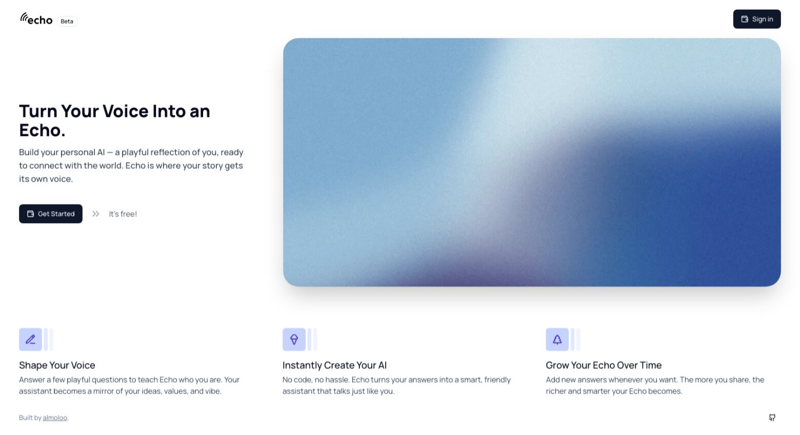
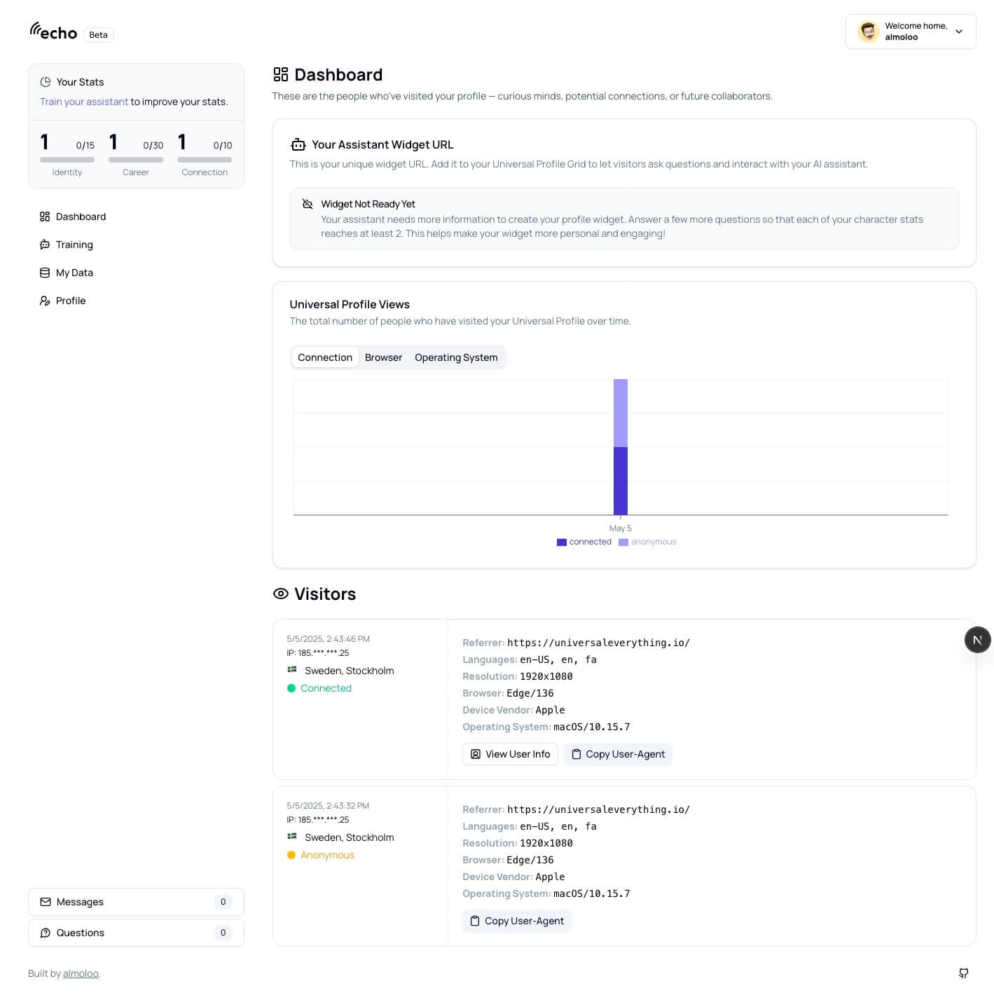

Echo turns a Lukso Universal Profile into something visitors can actually talk to. Profile owners train a personal AI assistant by answering a set of AI-generated questions about their career, identity, and connections; visitors embed the widget on their profile grid and can then ask it questions, leave a message, or send an LYX donation directly through the interface.

## How it works

Anything the assistant can't answer gets logged for the owner to review, so the assistant's coverage improves the more it's used instead of staying static. Owners get an analytics dashboard covering visitor device, location, and profile info (when available) alongside the log of unanswered questions — a feedback loop for what to train next.

## Key features

- **Personal AI assistant** trained through a guided Q&A flow plus public profile data
- **Visitor engagement** — questions, messages, and LYX donations through one widget
- **Continuous learning** — unanswered questions are logged for the owner to fill in later
- **Analytics dashboard** — visitor metrics and question logs in one place
- **Universal Profile integration** — blockchain-native authentication and donations via LSP7

## Tech stack

Next.js · TypeScript · Tailwind CSS + shadcn/ui · MongoDB · NextAuth · Lukso Universal Profile standards (ERC725, viem.js) · OpenAI API

## Screenshots

