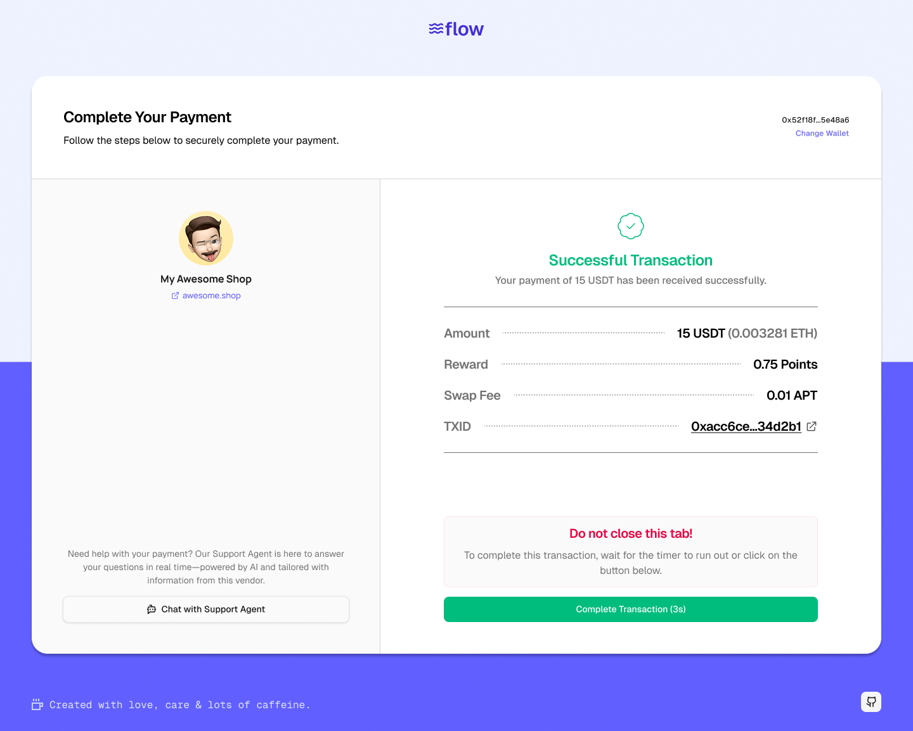

Flow is a payment gateway for small businesses that removes crypto's biggest adoption blocker: volatility. Customers pay with whatever token they hold — APT, BTC, USDT, and more — and vendors always receive stable USDT, with the conversion handled automatically on-chain.

## How it works

Every incoming payment is swapped through the **Liquidswap DEX** on Aptos before it reaches the vendor's balance, so the vendor never has to think about price movement between "customer paid" and "funds settled." Vendors get shareable payment links (and short links) per gateway, a full transaction/customer dashboard, and an AI support agent — powered by OpenAI — that fields customer questions during checkout.

The core logic lives in Move smart contracts: a `Vendor` resource tracks gateways and balances, and a `Gateway` resource tracks individual payments, so the whole payment history is auditable on-chain rather than sitting only in a database.

## Key features

- **Multi-token payments** settling to stable USDT via automatic swapping
- **AI support agent** for customer questions during checkout
- **Payment links** — shareable per-gateway links, plus short links
- **Analytics dashboard** — customers, transactions, and gateway performance
- **PWA-ready** — mobile-first, installable interface

## Tech stack

Next.js 14 · Tailwind CSS + shadcn/ui · React Query · Aptos blockchain + Move contracts · Liquidswap · MongoDB · MinIO · OpenAI GPT-4

Built with [Hossein](https://github.com/Hossein-79).

## Screenshots

