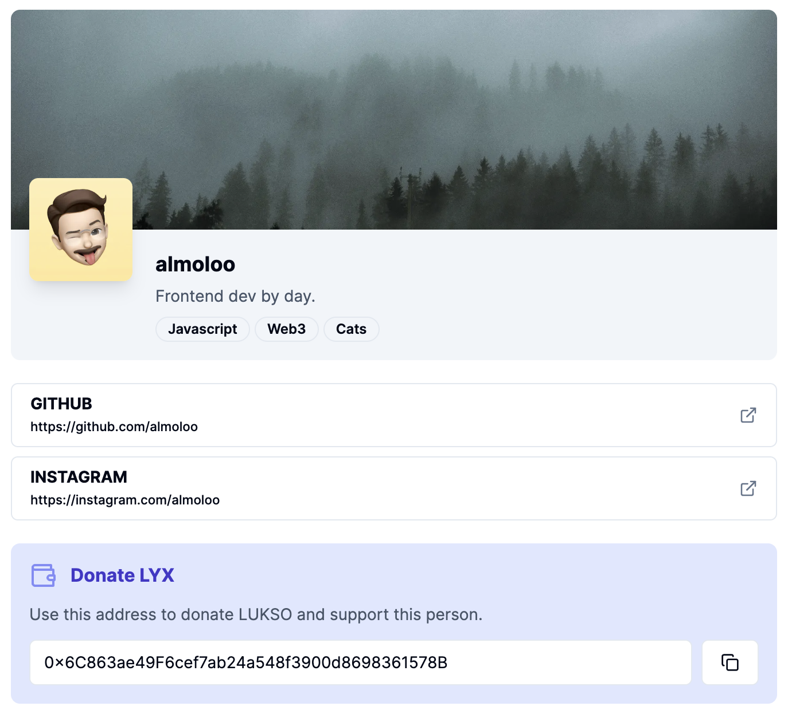

Luxo is a clean, standalone viewer for **Lukso Universal Profiles** — paste or navigate to a profile and see its data rendered without needing the full Lukso ecosystem tooling. Built specifically for the BuildUP #2 hackathon, it's a smaller, focused precursor to the profile-widget ideas explored later in Echo and Middleman.

## Tech stack

Next.js · React · shadcn/ui · Pinata (IPFS)

## Screenshots

