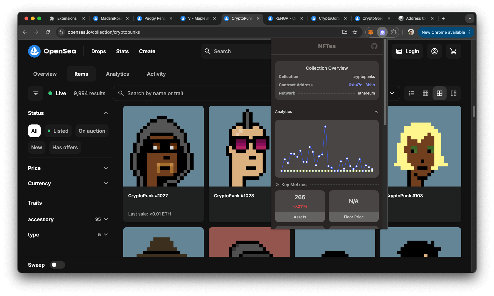
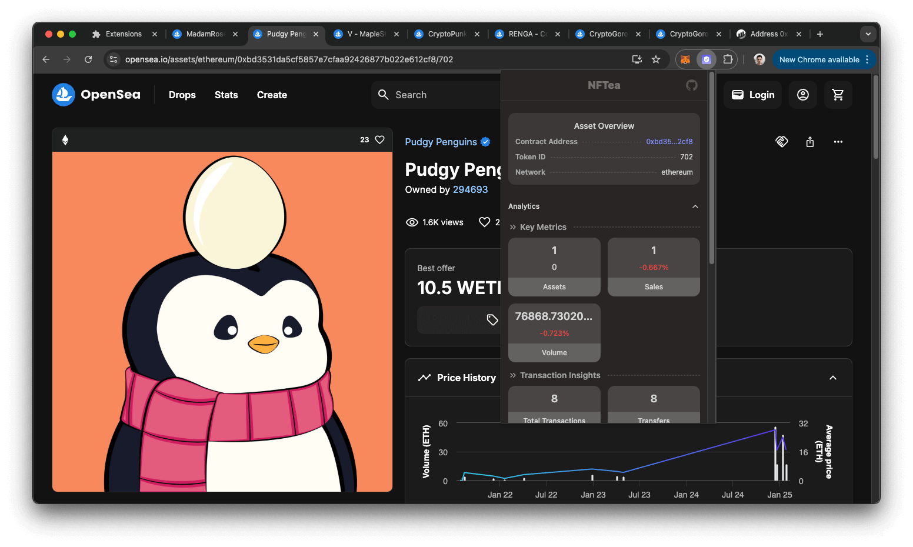
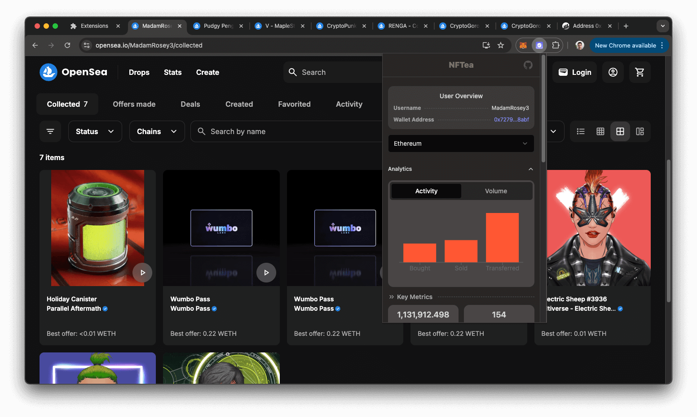

NFTea brings market data into the page you're already browsing instead of sending you off to a separate analytics dashboard. Browse a collection, asset, or wallet on OpenSea, and the extension overlays historical price/volume trends, holder distribution, and trading-pattern analysis — including wash-trade detection — right there.

## Key features

- **Collection insights** — price/volume history, holder distribution, whale tracking, trading-pattern scoring
- **Asset details** — price analytics, current holder, trading history, price estimates
- **Wallet analytics** — portfolio performance, trading patterns, activity metrics
- **Wash-trade detection** across collections, assets, and wallets
- **Privacy-respecting** — only reads the current OpenSea URL, no personal data collected

## Tech stack

React · TypeScript · Tailwind CSS + shadcn/ui · OpenSea API · UnleashNFT API

## Screenshots

