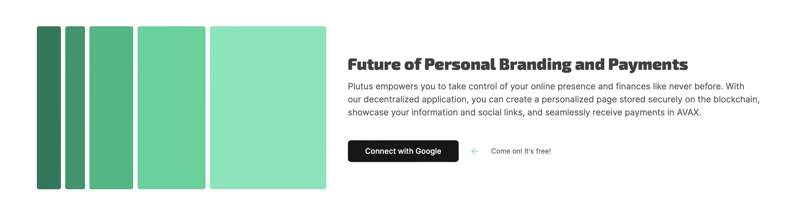

Plutus was built for the Avalanche Frontier hackathon to give creators a profile they fully control: sign in with Particle Network Auth (Google, Twitter, email, or wallet), get a unique profile URL tied to your wallet address, and let visitors send AVAX donations directly to support your work.

## How it works

Authentication runs through Particle Network, so a wallet address becomes the profile's identifier without forcing every visitor through a seed-phrase flow. Profile data — name, bio, picture — is written to the Avalanche network (Fuji testnet), and the dashboard uses the Covalent Unified API to surface "new users" and "latest transactions" pulled straight from on-chain smart contract events. The donation contract is ownable, with a configurable fee percentage taken on each donation received.

## Key features

- **Multi-method authentication** via Particle Auth, with wallet address as the unique identifier
- **On-chain profile creation** — name, bio, and avatar written to Avalanche
- **Public profile viewing** — any profile is viewable by wallet address
- **AVAX donations** — send crypto support directly, recorded by the Plutus contract
- **Configurable platform fee** — ownable contract with an adjustable donation fee

## Tech stack

Next.js · Solidity · Avalanche (Fuji testnet) · Particle Network Auth · Covalent Unified API

Built for the Avalanche Frontier hackathon with [Hossein](https://github.com/Hossein-79).

## Screenshots

