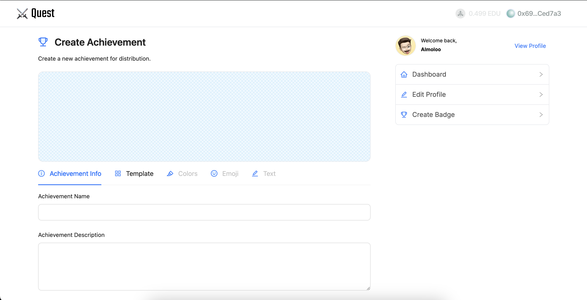

Quest lets people design, mint, and manage achievement badges on the **Open Campus** network — think verifiable credentials with a UI simple enough that "customize an emoji, pick a color, save it" is the whole flow.

## How it works

Achievements are built from templates with custom emoji, text, and color, then saved on-chain via Open Campus so ownership and authenticity are independently verifiable rather than resting on a database record. Files and metadata are pinned to IPFS through Pinata, and wallet connections run through Web3Modal.

## Key features

- **Customizable achievements** — templated badges with custom emoji, text, and colors
- **Blockchain-backed verification** — every achievement is stored and verifiable on Open Campus
- **Search and filter** — find achievements across a growing collection
- **Analytics** — basic insight into achievement activity

## Tech stack

Next.js · wagmi · Tailwind CSS · Pinata (IPFS) · Web3Modal · Ant Design

Built with [Hossein](https://github.com/hossein-79).

## Screenshots

