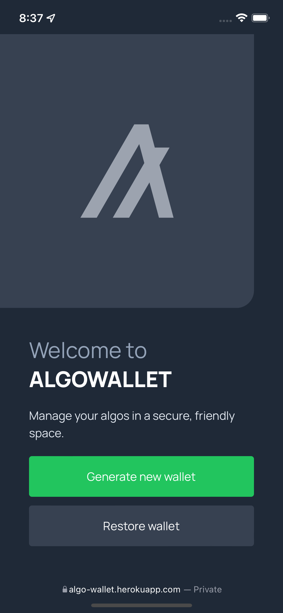
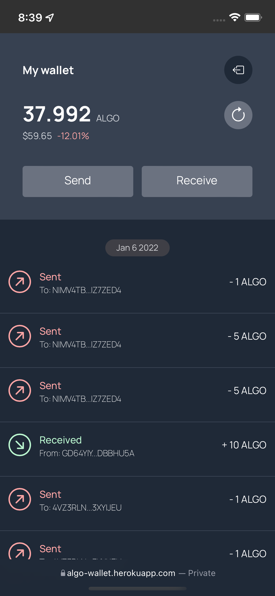

A custodial wallet for Algorand, built for a 30-day Gitcoin contest, focused on making the core wallet actions — generate, check balance, receive, send, review history — work through a simple web UI backed by **Tatum's** wallet API and SDK instead of wiring up Algorand's own SDKs from scratch.

## Key features

- **Wallet generation and balance** via Tatum's Algorand integration
- **Send and receive** with modal flows for both directions
- **Transaction history** — pulled from AlgoExplorer's API, since Tatum didn't expose this directly
- **Live ALGO price** — current price and daily change via the CoinGecko API

## Tech stack

Node.js · Express · EJS · Tatum API/SDK · Firebase Firestore · AlgoExplorer API · CoinGecko API

## Screenshots

