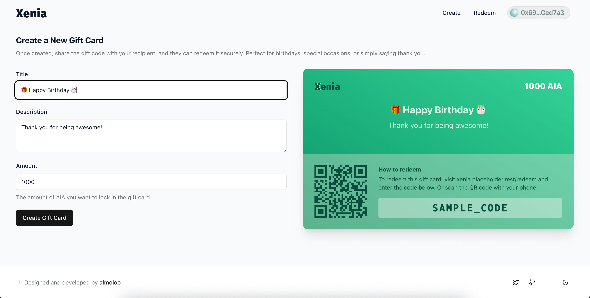
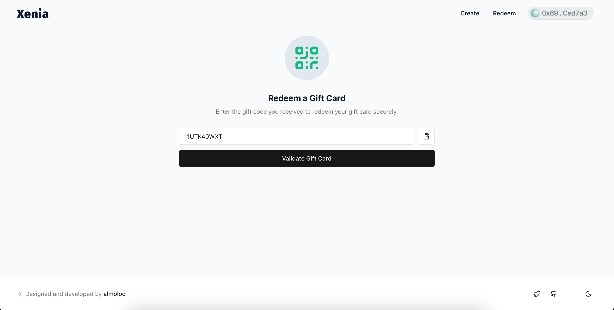
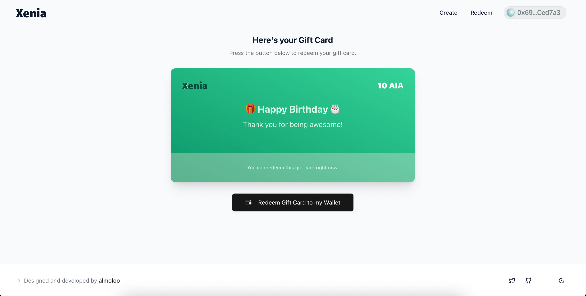

Xenia moves gift cards on-chain. Each card is created with a cryptographically hashed, unique code, so a card can't be forged or double-redeemed — every issue, validation, and redemption is a transparent, verifiable transaction rather than a row in a merchant's database.

## How it works

The `Xenia.sol` contract exposes the whole lifecycle: `createGiftCard` hashes a new card into existence, `validateGiftCard` checks whether a card exists and is still redeemable, `redeemGiftCard` transfers funds to the recipient and marks the card spent, and `getGiftCardsBySender` lets an issuer pull every card they've created.

## Key features

- **Secure creation** — unique, hashed codes prevent unauthorized or duplicate use
- **Full validation** — check existence and redemption status before trusting a card
- **Recipient-only redemption** — only a valid, unredeemed card can be cashed in
- **Fully on-chain and auditable** — every step is a transparent blockchain transaction

## Tech stack

Solidity · Hardhat · EVM (AIA network)

## Screenshots

